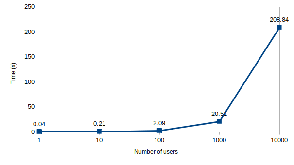

### When things take longer than you thought: Moving workloads to background processes

Drupalcon Lille - October 2023

---

### Pablo López Escobés

Drupal developer @ Lullabot

[@plopesc](https://www.drupal.org/u/plopesc)

---

## What is this about?

Efficiency and Responsiveness

Optimizing Resource Usage

Scalability and Concurrency

Note:
* When processing a web request, some tasks may be time-consuming or resource-intensive.
 Performing these tasks directly can slow down the response time, impacting user experience.
  * <small>Delegating such tasks to background processes ensures the web server remains responsive
    and efficient in handling primary request processing without delaying the initial response to the user.</small>
* Background processes can leverage additional server resources,
  preventing resource exhaustion and maintaining system stability.
  * <small>Delegating secondary tasks to separate processes allows for efficient resource
    management and improved overall system performance.</small>
* As user traffic increases, concurrency becomes crucial for effective web application performance.
  Blocking the main thread with time-consuming tasks reduces the application's ability to handle
  multiple requests concurrently.
  * <small>Offloading secondary tasks allows for scaling and handling more requests concurrently,
    providing a smoother and more responsive user experience even during peak traffic times.</small>

---

**By delegating secondary tasks to background processes, we enhance the efficiency, responsiveness, and scalability of our web application, ensuring optimal performance and a seamless user interaction.**

---

## Criteria

Critical vs. Non-Critical

Simple vs. Complex

CPU vs. I/O-bound

Urgent vs. Non-Urgent

User Direct Impact vs. User Indirect Impact

Note:
* There's no one-size-fits-all solution
* It depends on each situation
* I listed some criteria, but you can find other more useful

---

## Candidate tasks

EMail/Push Notifications, File Processing

Report Generation, Data Import/Export

Image Processing, Cache Clearing

Database Maintenance, Search Indexing

Logging and Analytics, PDF Generation

3rd party integrations, Collect Payments

Note:
* Stock for regular books or special first edition
* Payments for small store or Rolling Stone tickets
* Push notifications for heart surgery or supermarket offer 

---

# say.hi
<!-- .slide: data-background-gradient="linear-gradient(to bottom, #283b95, #17b2c3)" -->
Social Network <!-- .element: class="fragment" -->

### Broadcast messages to all users from a public form  <!-- .element: class="fragment" style="color:red" -->

--

--

## Form Submit Callback

<pre><code data-line-numbers="3-4|6-7|9-12">
public function submitForm(array &$form, FormStateInterface $form_state) {
  $message = $form_state->getValue('message');
  $name = $form_state->getValue('name');

  $users = $this->greetings
    ->sendGreetingsMultiple($name, $message);

  $this->messenger()
    ->addStatus(t('Greetings sent to @count folks.', [
      '@count' => count($users),
    ]));
}
</code></pre>

Note:
* Service that iterates and sends an email
* What could go wrong?
---

## How Request is processed

Note:
* This is something we all are used to see. Nothing new
* We need to focus on what happens during the build request phase
* Optimize not only time, but also server resources to increase bandwidth
* Not all the problems are solved increasing memory or adding new servers in parallel, that can be expensive
--

## What theory says

<!-- .slide: data-auto-animate -->
 <!-- .element: data-id="diagram" -->

Note:
* Let's dive into the internals of response generations process
* Multiple tasks, like loading entities, processing entities and prepare rendering
* Connect tasks with previous slide
* Our site only has a few visitors or nodes and everything is OK

--

## Site is getting traction. Bottlenecks appear

<!-- .slide: data-auto-animate -->
 <!-- .element: data-id="diagram" -->

Note:
* Our website is more and more popular, we did a great job and it's getting traction
* The number of concurrent users has grown and the number of interaction is bigger than expected
* We get a timeout or out of memory error in our logs from time to time
* Let's increase memory and let's see. Pass the buck

--

## Death of success

<!-- .slide: data-auto-animate -->
 <!-- .element: data-id="diagram" -->

<pre><code>PHP Fatal error:  Allowed memory size of 134217728 bytes...
</code></pre>

Note:
* Our site succumbed to success
* Situation does not scale
* We need to improve the Task 2 performance somehow

--

## Some numbers
<!-- .slide: data-auto-animate -->

--

## Some numbers
<!-- .slide: data-auto-animate -->

---

## Does Drupal provide tools to solve this bottleneck?

Note:
* We need to detect where are the bottlenecks. Apparently Task 2
* Improve the code, reduce redundancy, apply caches, etc
* What if we delegates part of these subtasks that are not critical for the main flow?

---

## Batch API
## Cron API
## Queue API

Note:
* Drupal provides some mechanisms to mitigate these situations
* They're different and cover different use cases
 
---

## Batch API
<!-- .slide: data-auto-animate -->

Note:
* This is screen should be familiar
--

## Batch API
<!-- .slide: data-auto-animate -->
Maintain resources under control

Tasks are not executed in background  <!-- .element: class="fragment" -->

Take control of the user browser <!-- .element: class="fragment" -->

**The operation's completion is not certain** <!-- .element: class="fragment" style="color:red" -->

Note:
* This is not a background task, but allows to have resources under control
  for tasks that needs to be executed in the main thread
* Update node permissions table, run database updates or bulk operations
* It can be used also to handle expensive tasks via Drush
* Provided by default when implementing hook_update_N and hook_post_update_NAME
* Not very friendly in general. Even more for non-administrative tasks.

--

## Batch diagram

Note:
* It splits the subtasks to execute them smaller chunks to ensure that server resources are under control
* Logic to determine chunk size and how to manage the resources is up to the developer

--

## Say.Hi Batch implementation
<pre><code data-line-numbers="5-13|15-21|23|29-31|36-39|44-53">
public function submitForm(array &$form, FormStateInterface $form_state) {
  ....
  // Set up batch operations.
  $batch = [
    'operations' => [
      ['::initBatch', [count($this->loadUserUids())]],
    ],
    'finished' => '::finishedCallback',
    'title' => $this->t('Sending greetings...'),
    'init_message' => $this->t('Starting processing'),
    'error_message' => $this->t('An error occurred during processing'),
  ];

  $chunks = array_chunk($this->loadUserUids(), 50);
  foreach ($chunks as $chunk) {
    $batch['operations'][] = [
      '\Drupal\say_hi\Form\HiBatchForm::processItems',
      [$chunk, $name, $message],
    ];
  }

  batch_set($batch);
}

/**
 * Inits the batch process.
 */
public static function initBatch(int $total, array &$context): void {
  $context['results']['total'] = $total;
}

/**
 * Sends the greetings.
 */
public static function processItems(array $uids, string $name, string $message, array &$context): void {
  \Drupal::service('say_hi.greetings')
    ->sendGreetingsMultiple($name, $message, $uids);
}

/**
 * Finish batch.
 */
public static function finishedCallback(bool $success, array $results, array $operations): void {
  if ($success) {
    \Drupal::messenger()
      ->addStatus(t('Greetings sent to @count folks.', [
    '@count' => $results['total'],
    ]));
    }
  else {
    \Drupal::messenger()->addError(t('Batch process failed.'));
  }
}
</code></pre>
Note:
* Simple implementation, there are more options
* Mention BatchBuilder class, introduced in 8.6

--

## Some numbers
<!-- .slide: data-auto-animate -->

--

## Some numbers
<!-- .slide: data-auto-animate -->

---

## Cron API

Based on hook_cron()

Executes recurring or scheduled tasks when it is invoked

Note:
* Centralized (for now) in hook_cron()
* Allows to schedule repetitive tasks that can be run in the background
* Check Cron.php file
* Remove orphan files from the filesystem, delete fields
* Search API indexation

--

## Limitations

Cron tasks may not all have the same requirements

Hard to have a clear overview of tasks run

Overlap / Timeout issues

**[Replace hook_cron() with a more modern approach](https://www.drupal.org/project/drupal/issues/3383487)** <!-- .element: class="fragment" -->

Note:
* Not very flexible
* Custom logic to manage different times
* Need to be careful if tasks take longer than expected (Overlap, Pantheon 5 minutes)

--

## Say.Hi Cron implementation
<!-- .slide: data-auto-animate -->
<pre data-id="code-animation"><code data-line-numbers>
function say_hi_cron() {
  $service = \Drupal('say_hi.maintenance'); 
  $service->maintainSite();
}
</code></pre>

Note:
* Show Me The Code

--

## Say.Hi Cron implementation
<!-- .slide: data-auto-animate -->
<pre data-id="code-animation"><code data-line-numbers="6-9">
function say_hi_cron() {
  $service = \Drupal('say_hi.maintenance'); 
  $service->maintainSite();

  $hour = date('H');
  if ($hour == 8) {
    $service->sayGoodMorning():
  }
}
</code></pre>

Note:
* Mention complexity to define tasks with different granularity in the same module

--

## Contrib modules

Simple Cron <!-- .element: class="fragment fade-in-then-semi-out" -->

Ultimate Cron <!-- .element: class="fragment fade-in-then-semi-out" -->

Note:
* Simple Cron: UI, different granularity and weight, access to the queues, define plugins
* Ultimate Cron: More flexibility, any callback can be a scheduled, parallel execution, custom rules for triggers, etc

--

## Custom cron based approaches
<pre><code data-line-numbers="2-3|5-6|8-10|12-13">
# Run the drupal cron process every hour of every day
0 * * * * /usr/bin/wget -O - -q http://mysite/cron/OpgO

# Re-generate the "categories" list (four times a day)
5 0,4,10,16 * * * drush my_module:regenerate-categories

# Rotate the ad banners every 20 minutes
10,30,50  * * * * drush php:eval 
"\Drupal::service('banner_manager')->rotateBanner();"

# Process the mail queue every 2 minutes
*/2 * * * * drush queue:run mail_queue

</code></pre>
Note:
* No need to add extra modules
* Requires some extra knowledge
* Logging needs to be done manually
* Needs to be done at server level. Not available in all the SASS platforms
* 3rd party services (EasyCron, Pingdom)

---

## Queue API

Offloads resource-intensive or time-consuming tasks from the main application for improved performance.

Ensures efficient processing by allowing background execution of tasks.

Note:
* Drupal provides Queue API but this is not new
* Lots of different queue providers and most of frameworks provides queue support
* By default, it uses queue table, but new tables can be created as services,
  and it is possible to define new backends
* Generate Media thumbnails
 
--

## Queue diagram

Note:
* List of items
* create, claim, delete, release
* QueueInterface & ReliableQueueInterface
* Different backends
 
--

## Working with queues
<pre><code data-line-numbers="2-3|5-6|10-11|13-20">
// Get the queue.
$my_queue = \Drupal::queue('my_queue');

// Add item to the queue
$my_queue->createItem($my_data);

...

// Claim item from the queue
$item = $my_queue->claimItem();

try {
  $this->process($item->data);
  // Delete item once processed.
  $my_queue->deleteItem($item);
} catch (\Exception $e) {
  // Release item to process it later if failed.
  $queue->releaseItem($item);
}
</code></pre>

Note:
* 4 Elements (Factory, Queue, Item, Backend)
* Create and process a Queue in Drupal is as simple as this
* Queues can have other operations like delay, depending on the queue type
* It can be complex to know when and how to process these queues
* Most the times we just need to iterate over the queue during cron
* Drupal provides QueueWorkers to automate this

--

## Say.Hi queue implementation

<pre><code data-line-numbers="3|9-13">
public function submitForm(array &$form, FormStateInterface $form_state) {
  $queue = $this->queueFactory->get('say_hi_greetings');
  $message = $form_state->getValue('message');
  $name = $form_state->getValue('name');

  $uids = $this->loadUserUids();

  array_walk($uids, function (int $uid) use ($name, $message, $queue) {
    $queue->createItem(
      new GreetingQueueItem($uid, $name, $message)
    );
  });

  $this->messenger()->addStatus($this->t('Greetings sent to @count folks.',
    [
      '@count' => count($uids),
    ]));
}
</code></pre>

--

## Queue risks
<!-- .slide: data-auto-animate -->
<pre><code class="console">
$ drush queue:list
 ------------------ ------- --------------------------------- 
  Queue              Items   Class                            
 ------------------ ------- --------------------------------- 
  say_hi_greetings   264478   Drupal\Core\Queue\DatabaseQueue  
 ------------------ ------- --------------------------------- 

$ drush queue:run say_hi_greetings
PHP Fatal error:  Allowed memory size of 134217728 bytes...
</code></pre>

Note:
* Life isn't all roses
* Queue grows faster than it is processed, so expected tasks are not being executed
* Number of queues overlaps one execution with the next
* Could be mitigated by using Queue Unique module
* Try different cron setups using cron related modules or running queues directly from crontab

--

## Queue risks
<!-- .slide: data-auto-animate -->

Scalability and Resource Management

Operational Complexity

Prioritization

Note:
* Queue can become overloaded, causing delays and potential system instability
* Fairly prioritizing tasks within a queue can be challenging, especially when
  dealing with tasks of varying importance or urgency.
* Scaling the queue management system efficiently as the load grows and managing
  resources effectively to handle the increasing demand.

--

## QueueWorkers

Automate generic queue processing operations

Incorporate additional features for queue management

Note:
* Plugins that define how to process queue items
* It automates the process of claiming items during cron runs and takes care of
  timeouts when queue size grows
* Provides specific exceptions to handle the items in different ways
* Drush & related modules integration
* Media thumbnail and download locale translations in core

--

## Say.Hi QueueWorker
<pre><code data-line-numbers="7-11|19-31|33-38">
namespace Drupal\say_hi\Plugin\QueueWorker;

/**
 * Process a queue of of greeting items.
 *
 * @QueueWorker(
 *   id = "say_hi_greetings",
 *   title = @Translation("Say Hi Greetings"),
 *   cron = {"time" = 60}
 * )
 */
class GreetingsSender extends QueueWorkerBase {

  /**
   * {@inheritdoc}
   */
  public function processItem($data) {
    if ($data->delayItem()) {
      // Add item back to the queue but delay execution.
      throw new DelayedRequeueException(10);
    }
    if ($data->requeueItem()) {
      // Add item back to the queue immediately.
      throw new RequeueException();
    }
    if ($data->suspendQueue()) {
      // Release the item and stop processing the queue.
      // Allows to define a delay.
      throw new SuspendQueueException();
    }

    // If nothing happens the item is deleted
    // from the queue after processing.
    $user = $this->userStorage->load($data->uid);
    $this->greetings->sendGreetings(
      new Greeting($user, $data->name, $data->message)
    );
  }

}
</code></pre>
 
Note:
* Talk about exceptions
* DelayItem is an "at least". Might be postponed to next execution if queue is finished
* SuspendQueueException accepts a delay parameter. Can be retaken if cron has bot been finished

--

## Contrib modules
Queue UI <!-- .element: class="fragment fade-in-then-semi-out" -->

External queues: RabbitMQ, Kafka, SQS... <!-- .element: class="fragment fade-in-then-semi-out" -->

Queue Unique  <!-- .element: class="fragment fade-in-then-semi-out" -->

Warmer  <!-- .element: class="fragment fade-in-then-semi-out" -->

Note:
* Queue UI, could not be necessary if Ultimate Cron or Simple Cron are present
* External Queues, like RabbitMQ, Kafka, SQS
* Queue Unique, Warmer

--

## Some numbers
<!-- .slide: data-auto-animate -->

--

## Some numbers
<!-- .slide: data-auto-animate -->

---

## Comparison
<!-- .slide: data-auto-animate -->

--

## Comparison
<!-- .slide: data-auto-animate -->

---

## Takeaways

Task analysis is crucial

Strategic Balance

Scalability Advantage

Enhanced User Satisfaction <!-- .element: class="fragment highlight-red" -->

Note:
* Usage of these tools might require some knowledge and requires time to implement
* Need to be realistic. We can leave them out of the MVP, but develop our code having
  in mind that it could be moved into a batch or queue in the future (implement different services) 

---

<blockquote>
  “The fastest task is the task not done”
</blockquote>

---

## Thank you
<!-- .slide: data-auto-animate -->

**[https://plopesc.github.io/background_tasks_slides](https://plopesc.github.io/background_tasks_slides)**

**[https://github.com/plopesc/say_hi](https://github.com/plopesc/say_hi)**
---

## Questions?
<!-- .slide: data-auto-animate -->

**[https://plopesc.github.io/background_tasks_slides](https://plopesc.github.io/background_tasks_slides)**

**[https://github.com/plopesc/say_hi](https://github.com/plopesc/say_hi)**